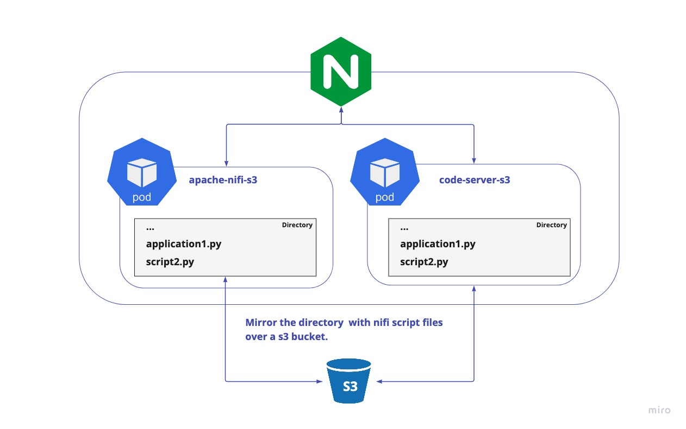

# apache-nifi-s3
This is a fork of the apache/nifi container with an integrated s3 directory at the nifi root path. This docker can be used inside a kubernetes to access files for the apache nifi.

# Why

At passived.app we use the apache/nifi framework to update all our informations about the defi-apps and chains. 
Therefore we use a python script and multiple Connectors to check/update different attributes of the projects.



## Use with kubernetes

apache-nifi-s3.yaml:

```
---
apiVersion: apps/v1
kind: StatefulSet
metadata:
  name: nifi
  namespace: default
spec:
  selector:
    matchLabels:
      app: nifi
  template:
    metadata:
      labels:
        app: nifi
    spec:
      containers:
        - securityContext:
            privileged: true
        - name: nifi
          image: passivedapp/apache-nifi-s3
          ports:
            - name: https
              containerPort: 8443
          env:
            - name: SINGLE_USER_CREDENTIALS_USERNAME
              value: admin
            - name: SINGLE_USER_CREDENTIALS_PASSWORD
              value: "<default-password-for-admin>"
            - name: NIFI_WEB_HTTPS_PORT
              value: '8443'
            - name: ACCESS_KEY
              value: "<bucket-access-key>"
            - name: SECRET_KEY
              value: "<bucket-secret-key>"
            - name: BUCKET_NAME
              value: "<your-bucket-name>"
            - name: S3_URL
              value: https://s3.fr-par.scw.cloud
            - name: S3_REGION
              value: fr-par


```


## Use with docker

```

docker run -d \
    -e SINGLE_USER_CREDENTIALS_USERNAME=admin \
    -e SINGLE_USER_CREDENTIALS_PASSWORD=<default-password-for-admin> \
    -e SINGLE_USER_CREDENTIALS_USERNAME=8443 \
    -e SINGLE_USER_CREDENTIALS_USERNAME=<bucket-access-key> \
    -e SINGLE_USER_CREDENTIALS_USERNAME=<bucket-secret-key> \
    -e SINGLE_USER_CREDENTIALS_USERNAME=<your-bucket-name> \
    -e SINGLE_USER_CREDENTIALS_USERNAME=https://s3.fr-par.scw.cloud \
    -e SINGLE_USER_CREDENTIALS_USERNAME=fr-par \
    --name apache-nifi-s3 \
     passivedapp/apache-nifi-s3 


```
 

